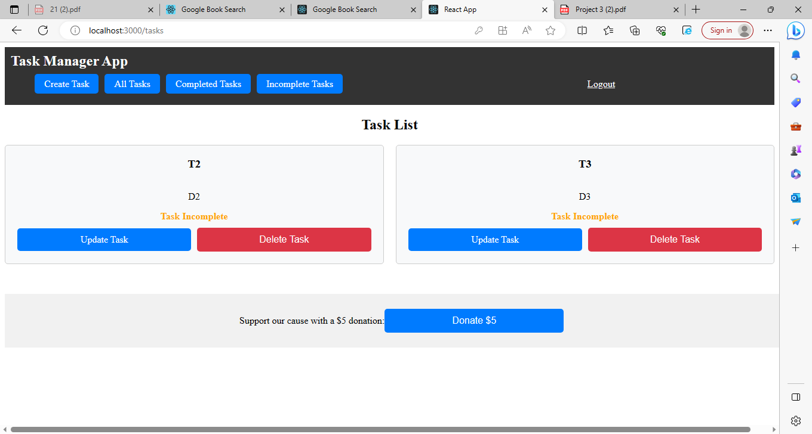
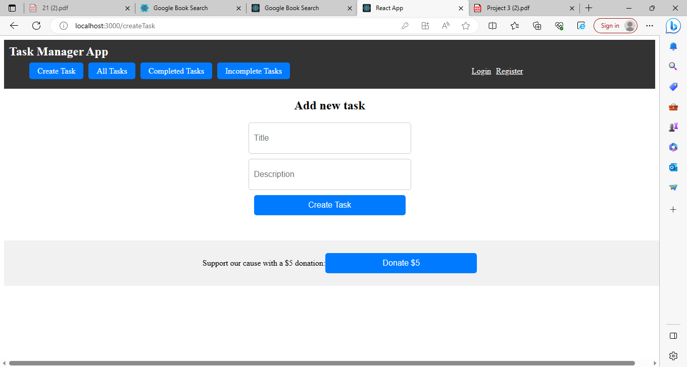
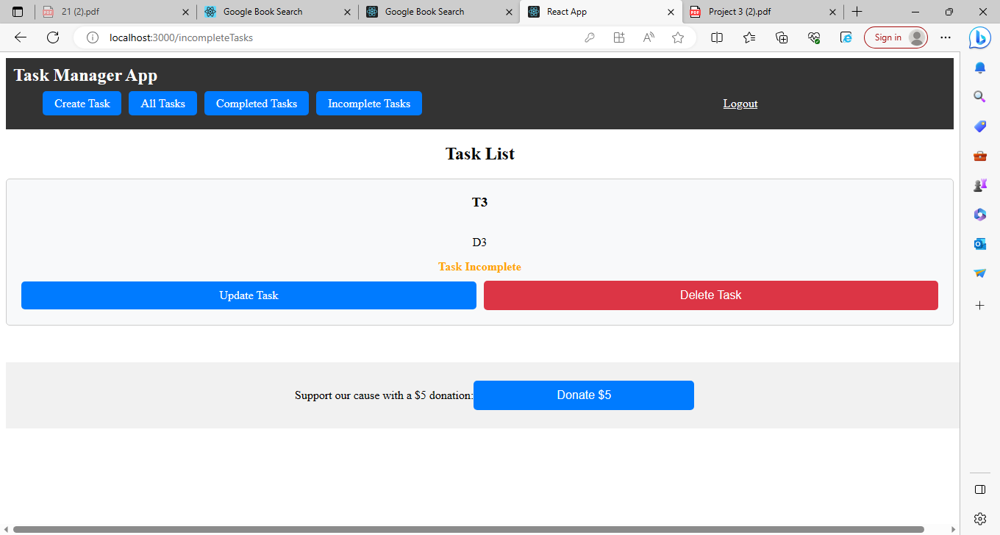
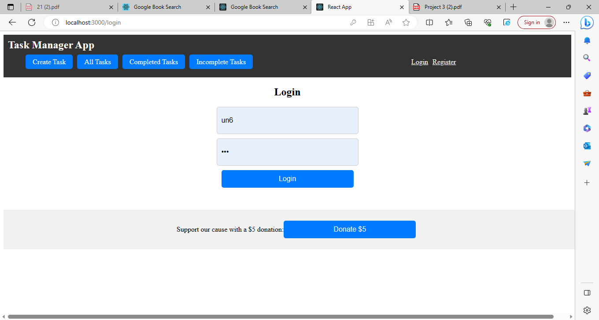
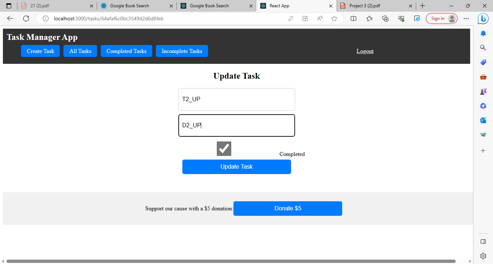

# TASK MANAGER APP 

TaskManagerApp is a full-stack task management web application built with React, GraphQL, Node.js, Express.js, and MongoDB. It allows users to efficiently manage their tasks by 
providing features such as task creation, updating, deletion, and viewing. The application has a polished and responsive UI, ensuring a seamless user experience across devices. It 
incorporates authentication using JSON Web Tokens (JWT) for secure access to user-specific data. API key information is protected on the server, and custom CSS is used for styling. 
TaskManagerApp also integrates with the Stripe payment platform for accepting charitable donations.

# Photos of the application

## To run the app
1. Go to .env on server file and run node index.js
2. after node index.js has been connected with the database, go to .env file on client and run npm start. Use the http link to go to the page. 

## Technologies Used

The TaskManagerApp project utilizes the following technologies and frameworks:

Front-end:
- React: A JavaScript library for building user interfaces.
- Apollo Client: A comprehensive state management library for GraphQL.

Back-end:
- Node.js: A JavaScript runtime environment for server-side development.
- Express.js: A web application framework for Node.js.
- GraphQL: A query language and runtime for APIs.
- Apollo Server: A GraphQL server implementation for Node.js.
- MongoDB: A popular NoSQL database for storing application data.
- Mongoose: An Object Data Modeling (ODM) library for MongoDB.

Other:
- JSON Web Tokens (JWT): A standard for securely transmitting information between parties as a JSON object.
- Stripe: A payment processing platform for accepting online payments.
- CSS: Cascading Style Sheets for styling the application's UI.

## Features

The TaskManagerApp project includes the following features:

1. User Authentication: Users can register, log in, and log out of the application using JWT-based authentication.
2. Task Management: Users can create, read, update, and delete tasks. Tasks include a title, description, and completion status.
3. Task Filtering: Users can view all tasks, completed tasks, and incomplete tasks using separate routes or filters.
4. Create Task: Users can create new tasks by providing a title, description.
5. Update Task: Users can edit the title, description, and completion status of existing tasks.
6. Delete Task: Users can delete tasks they no longer need.
7. Responsive Design: The application is designed to be responsive, ensuring a consistent user experience across different devices and screen sizes.
8. Interactive UI: The user interface is interactive, allowing users to perform actions such as creating, updating, and deleting tasks with ease.
9. Polished UI: The UI is designed with a clean and modern look, providing a visually appealing experience for users.
10. Integration with Stripe: The application integrates with the Stripe payment platform, enabling users to make charitable donations.
11. Protected API Key Information: Sensitive API key information is securely stored on the server to protect it from unauthorized access.

## Deploy 
You can visit the app by using this link: https://taskmanagerapp1-79875ae07008.herokuapp.com/
 https://rlee7029.github.io/taskmanagerapp/

 xxx